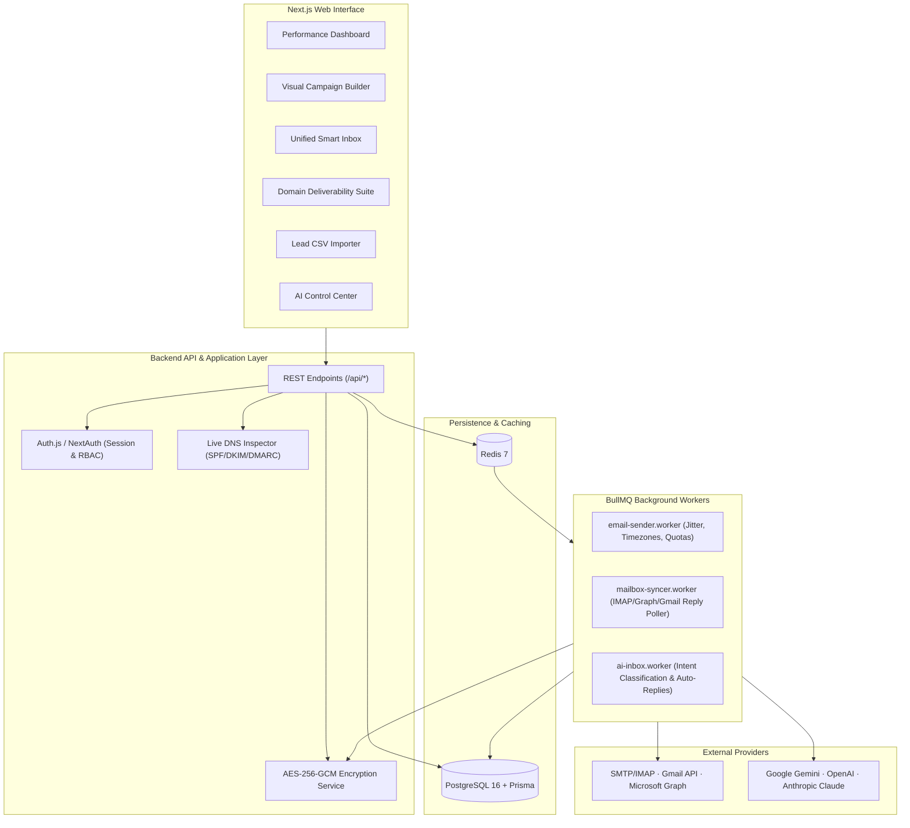

# AI Outreach OS ⚡

[](https://github.com/vineelakash/ai-outreach-os/actions/workflows/ci.yml)
[](https://www.typescriptlang.org/)
[](https://nextjs.org/)
[](https://www.prisma.io/)
[](https://bullmq.io/)
[](https://tailwindcss.com/)
[](https://opensource.org/licenses/MIT)

**AI Outreach OS** is a production-grade, self-hosted AI outbound sales engagement and email platform. Built from first principles with an original SaaS architecture, it empowers revenue teams to connect multiple business domains and mailboxes, run multi-step cold outreach campaigns, personalize emails with grounded multi-model AI, inspect DNS deliverability (SPF/DKIM/DMARC), and manage conversations in an autonomous Smart Unified Inbox.

---

## 🏗️ Architecture Overview



---

## ✨ Key Features

### 1. Abstracted Email Provider Engine
- **Generic SMTP / IMAP**: High-performance pooled SMTP via `nodemailer` and TLS/STARTTLS IMAP sync with `imapflow`.
- **Google Workspace / Gmail**: Direct REST API integration with OAuth 2.0 token management.
- **Microsoft 365 / Azure AD**: Microsoft Graph API dispatch and thread synchronization.
- **Mock Provider**: Instant zero-config test environment preventing live emails during development and CI.
- **Zero Plaintext Secrets**: All passwords and OAuth tokens are encrypted at rest using **AES-256-GCM**.

### 2. Multi-Model AI Layer
Select and configure the AI model used across different workflow stages:
- **Google Gemini**: Gemini 1.5 Flash, Gemini 1.5 Pro, Gemini 2.5 Flash
- **OpenAI**: GPT-4o, GPT-4o-mini, o3-mini
- **Anthropic Claude**: Claude 3.5 Haiku, Claude 3.7 Sonnet
- **Strict Grounding**: Hallucinations strictly forbidden by prompt engineering; personalizes only with verified lead fields.
- **Structured Outputs**: Validated against Zod schemas for deterministic JSON parsing.

### 3. Domain & Deliverability Intelligence
- **Native DNS Resolvers**: Queries real TXT records for SPF (`v=spf1`), DKIM (`_domainkey`), and DMARC (`_dmarc`).
- **Deliverability Health Score**: 0–100 score based on protocol compliance and historical bounce metrics.
- **Copy-Paste DNS Guides**: Copy-paste record generators for Cloudflare, GoDaddy, and Namecheap.

### 4. Resilient Sending Engine (BullMQ + Redis)
- **Timezone Scheduling**: Sends only during working hours in target recipient timezones.
- **Randomized Jitter Delays**: Injects 120s–300s jitter between messages to avoid spam filters.
- **Mailbox Daily Limits**: Automatically rotates outbound emails across active mailboxes.
- **Idempotency Protection**: Deterministic key generation (`send_{leadId}_step_{step}`) ensures no duplicate sends.
- **Automated Sequence Halting**: Halts active sequence steps immediately upon reply, bounce, or unsubscribe.

### 5. Unified Smart Inbox
- **Intent Badges**: Categorizes replies (`INTERESTED`, `MEETING_REQUEST`, `QUESTION`, `UNSUBSCRIBE`, etc.).
- **AI Summary Card**: Generates a 1-sentence summary and recommended SDR action.
- **3 Reply Automation Modes**:
  - **Manual**: AI drafts replies for human approval and one-click sending.
  - **Semi-Automatic**: Automatically handles high-confidence common questions; flags sensitive for review.
  - **Automatic**: Autonomous agent mode with strict safety overrides (legal, unsubscribe, and ambiguous intent bypass auto-send).

### 6. Privacy-Respecting Analytics & Compliance
- **Google Analytics 4**: Tracks macro operational events (`campaign_launched`, `reply_received`).
- **Strict PII Guardrail**: Under no circumstance are contact emails, names, or email contents sent to GA4.
- **RFC 8058 One-Click Unsubscribe**: Automatic `List-Unsubscribe` headers and customizable footers.

---

## 🚀 Quickstart

### Prerequisites
- Node.js v20+ or v24+
- Docker & Docker Compose
- Git

### 1. Clone & Setup Environment
```bash
git clone https://github.com/vineelakash/ai-outreach-os.git
cd ai-outreach-os
cp .env.example .env
```

### 2. Run with Docker Compose
```bash
docker compose up -d --build
```

### 3. Run Database Migrations & Demo Seed Data
```bash
docker compose exec app npx prisma db push
docker compose exec app npm run db:seed
```

### 4. Access the Dashboard
- **URL**: [http://localhost:3000](http://localhost:3000)
- **Email**: `demo@outreach-os.local`
- **Password**: `password123`

---

## 🛠️ Local Development (Without Docker)

```bash
# 1. Install dependencies
npm install --legacy-peer-deps

# 2. Push database schema
npx prisma db push

# 3. Populate development seed data
npm run db:seed

# 4. Start Next.js development server
npm run dev

# 5. In a separate terminal, run background worker
npm run worker
```

---

## 🧪 Testing

AI Outreach OS includes a comprehensive Vitest test suite covering encryption, email adapters, AI Zod validation, timezone schedules, and CSV parsing:

```bash
# Run unit & integration tests
npm test

# Run TypeScript type safety check
npx tsc --noEmit
```

---

## 📁 Repository Structure

```
ai-outreach-os/
├── app/                           # Next.js App Router (Pages, UI, API Routes)
│   ├── (dashboard)/               # Dashboard, Campaigns, Leads, Inbox, Mailboxes, Domains, Analytics
│   ├── api/                       # REST endpoints (auth, campaigns, leads, mailboxes, tracking, health)
│   └── layout.tsx                 # Root layout with SaaS sidebar navigation
├── components/                    # Reusable React UI components
├── lib/
│   ├── ai/                        # Multi-model AI abstraction (OpenAI, Gemini, Claude, Mock)
│   ├── email/                     # Email provider adapters (SMTP/IMAP, Gmail, MS Graph, Mock)
│   ├── deliverability/            # Live DNS queries for SPF, DKIM, DMARC
│   ├── security/                  # AES-256-GCM encryption, rate limiting, audit logging
│   ├── campaigns/                 # Sequence engine, timezone windows, jitter, idempotency
│   ├── queue/                     # BullMQ queues and Redis client
│   ├── analytics/                 # First-party metrics and privacy-safe GA4
│   └── db/                        # Prisma singleton
├── prisma/
│   ├── schema.prisma              # Normalized PostgreSQL schema (20+ models)
│   └── seed.ts                    # Realistic demo seed data
├── workers/                       # BullMQ background worker engine
│   ├── email-sender.worker.ts     # Sequence sending processor
│   ├── mailbox-syncer.worker.ts   # Reply detection poller
│   └── ai-inbox.worker.ts         # Intent classification & auto-reply worker
├── tests/                         # Vitest test suite (100% pass)
├── docs/                          # In-depth technical guides
│   ├── ARCHITECTURE.md
│   ├── EMAIL_PROVIDERS.md
│   ├── AI_PROVIDERS.md
│   ├── DEPLOYMENT.md
│   ├── SECURITY.md
│   ├── EMAIL_DELIVERABILITY.md
│   └── CONTRIBUTING.md
├── docker-compose.yml             # Docker multi-service deployment
├── Dockerfile                     # Multi-stage production build
├── .github/workflows/ci.yml       # GitHub Actions CI workflow
└── README.md
```

---

## 🔐 Environment Variables

| Variable | Description | Default |
|---|---|---|
| `DATABASE_URL` | PostgreSQL connection string | `postgresql://...` |
| `REDIS_URL` | Redis connection URL | `redis://localhost:6379` |
| `NEXTAUTH_SECRET` | 32+ character session signing secret | Generated |
| `ENCRYPTION_KEY` | 32-byte secret for AES-256-GCM encryption at rest | Required |
| `AI_PROVIDER` | Default AI provider (`openai`, `gemini`, `anthropic`, `mock`) | `mock` |
| `OPENAI_API_KEY` | OpenAI API key | Optional |
| `GEMINI_API_KEY` | Google Gemini API key | Optional |
| `ANTHROPIC_API_KEY` | Anthropic Claude API key | Optional |
| `NEXT_PUBLIC_GA_ID` | Google Analytics 4 Measurement ID | Optional |
| `ENABLE_OPEN_TRACKING` | Enable 1x1 tracking pixel | `true` |
| `ENABLE_CLICK_TRACKING`| Enable redirect click tracking | `true` |

---

## 📄 Documentation Links
- [System Architecture](docs/ARCHITECTURE.md)
- [Email Providers Setup](docs/EMAIL_PROVIDERS.md)
- [Multi-Model AI Guide](docs/AI_PROVIDERS.md)
- [Self-Hosted Deployment](docs/DEPLOYMENT.md)
- [Security & Encryption Architecture](docs/SECURITY.md)
- [Email Deliverability & Compliance](docs/EMAIL_DELIVERABILITY.md)
- [Contributing Guidelines](docs/CONTRIBUTING.md)

---

## ⚖️ License
Released under the [MIT License](LICENSE).
