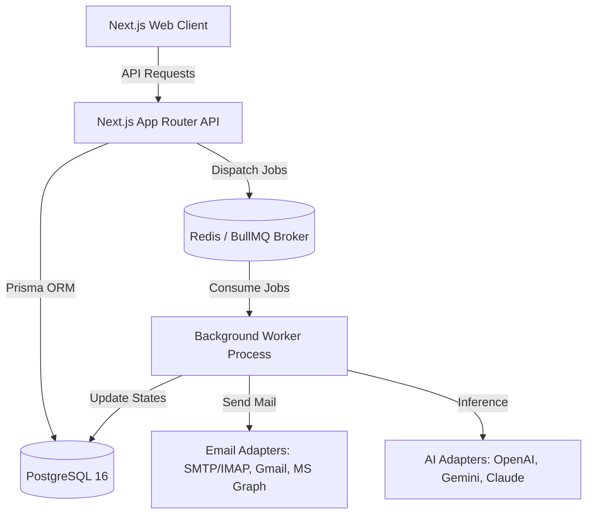

# AI Outreach OS - Architecture Specification

## 1. Overview
**AI Outreach OS** is a self-hosted outbound sales engagement platform designed for high deliverability, automated reply intelligence, and multi-model AI workflows.

## 2. Core Subsystems

### A. Email Provider Abstraction Layer
The application abstracts all outbound and inbound email communications behind a unified `EmailProvider` interface:
- **`SmtpImapProvider`**: Uses `nodemailer` with connection pooling for sending and `imapflow` for TLS/STARTTLS message synchronization.
- **`GmailProvider`**: Interacts with the Google Workspace Gmail API using OAuth 2.0.
- **`MicrosoftGraphProvider`**: Dispatches via Microsoft Graph API `/me/sendMail` and syncs `/me/mailFolders/inbox/messages`.
- **`MockEmailProvider`**: In-memory test provider preventing real dispatch during development and automated tests.

All credentials (passwords, tokens) are encrypted with **AES-256-GCM** before database storage.

### B. Multi-Model AI Engine
The `AIProvider` interface powers:
1. **Multi-Step Copywriting**: Generates sequences formatted with delay days, subjects, bodies, and merge tags.
2. **Fact-Grounded Personalization**: Personalizes lines strictly from provided lead fields (company, title, industry), prohibiting hallucinations.
3. **Reply Intent Classification**: Categorizes incoming messages into `INTERESTED`, `MEETING_REQUEST`, `QUESTION`, `NOT_INTERESTED`, `UNSUBSCRIBE`, or `OUT_OF_OFFICE`.
4. **Autonomous Reply Drafting**: Produces context-aware suggested drafts for human approval or automated dispatch.

Supported AI Providers:
- **OpenAI**: GPT-4o, GPT-4o-mini
- **Google Gemini**: Gemini 1.5 Flash, Gemini 1.5 Pro
- **Anthropic Claude**: Claude 3.5 Haiku, Claude 3.7 Sonnet

### C. Background Queue & Scheduler (BullMQ)
Distributed queues manage asynchronous operations:
- `email-send-queue`: Verifies campaign status, lead status (suppression check), timezone sending window (e.g. 9am-5pm EST), daily mailbox quota, and injects randomized delay jitter (120s–300s).
- `mailbox-sync-queue`: Checks mailboxes for new inbound emails, updates thread history, and triggers sequence halting.
- `ai-reply-queue`: Evaluates inbound replies with AI, assigns intent, and handles semi-automatic or automatic responses.

### D. Deliverability & DNS Verification
The deliverability suite performs real-time DNS queries against:
- **SPF**: Verifies `v=spf1` inclusion.
- **DKIM**: Inspects `_domainkey` selectors.
- **DMARC**: Validates `_dmarc` policy (`p=none`, `p=quarantine`, `p=reject`).
Calculates a 0–100 Deliverability Health Score based on observable technical factors.
